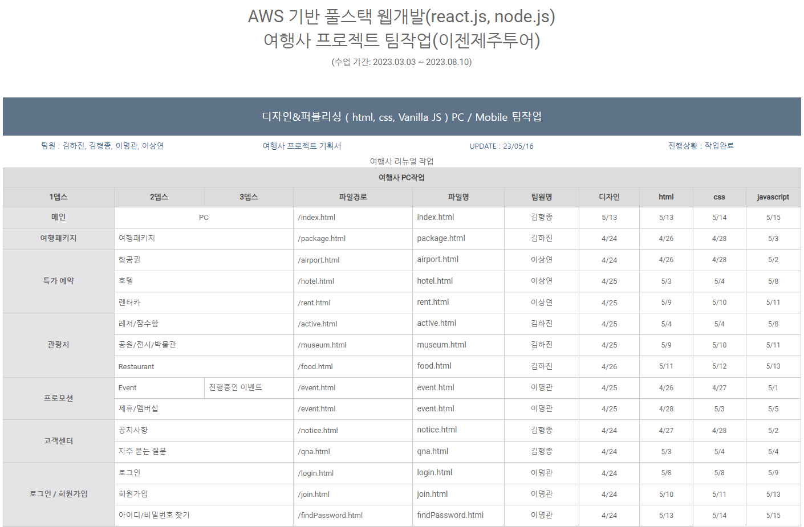
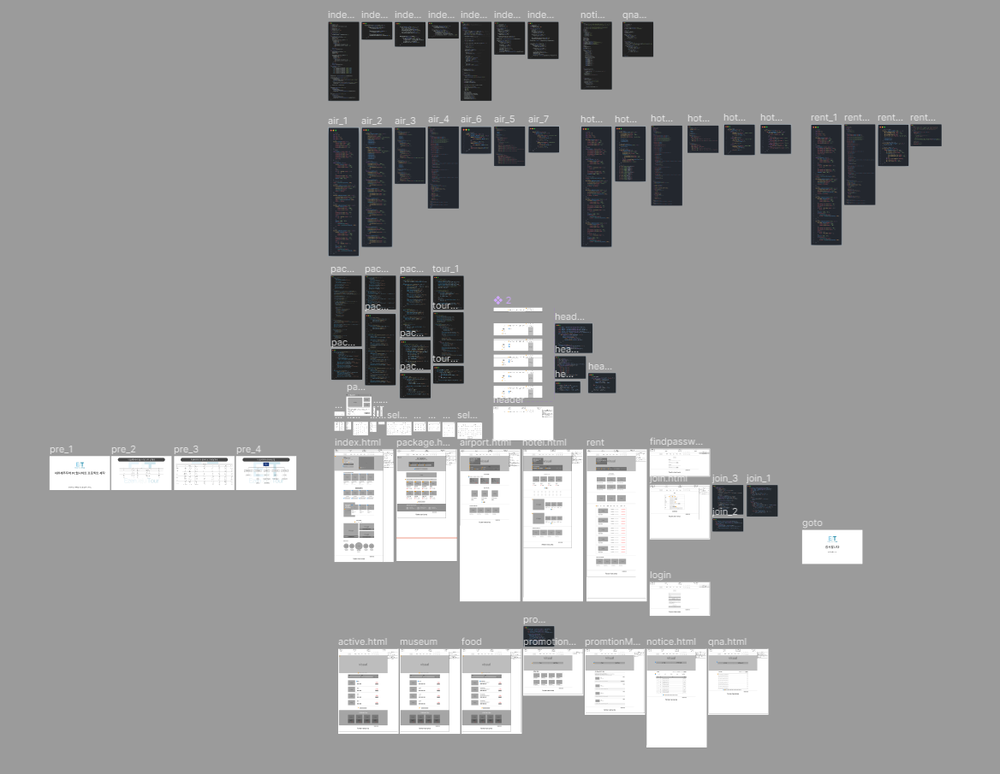
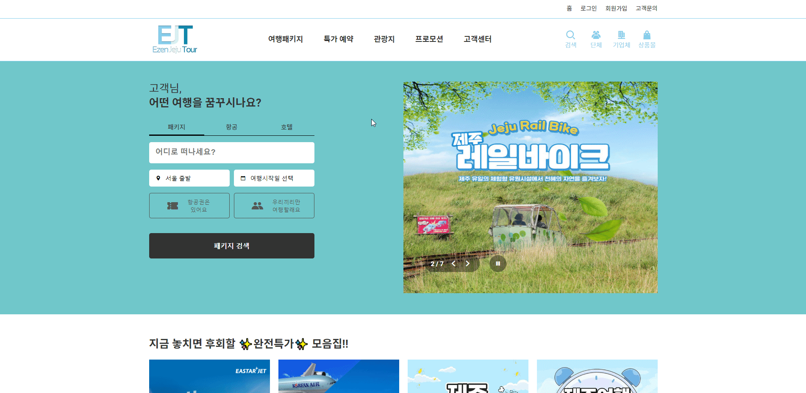
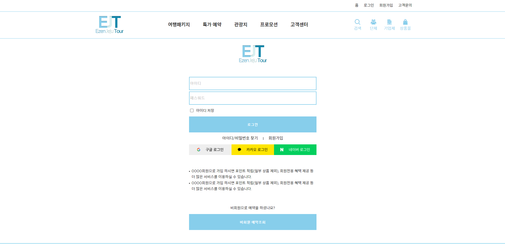
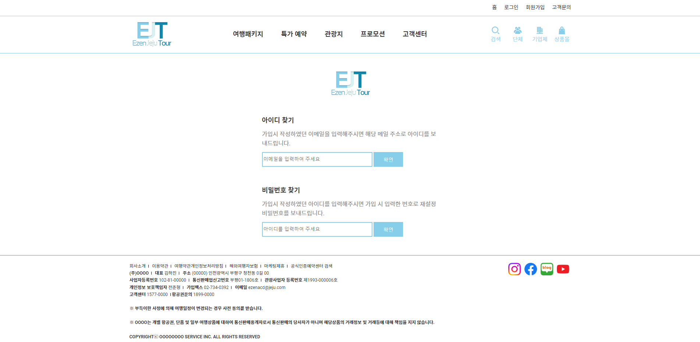
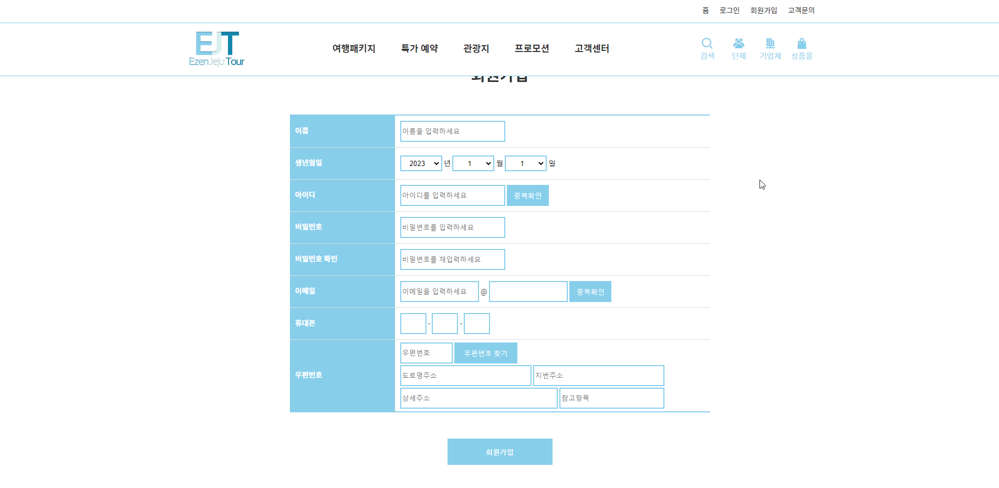

# 여행사 홈페이지 제작 - 이젠제주투어 (팀작업)

## 팀원

|             | 이름   | Github                                  | 작업사항                                                                                                                                                                                                                                                                                                 |
| :---------- | :----- | :-------------------------------------- | :------------------------------------------------------------------------------------------------------------------------------------------------------------------------------------------------------------------------------------------------------------------------------------------------------- |
| FE          | 김하진 | [@HajinKimm](https://github.com/HajinKimm) | [여행패키지](https://yeonhub.github.io/TP-EZtour_vanillaJS/package.html) [레저/잠수함](https://yeonhub.github.io/TP-EZtour_vanillaJS/active.html) [공원/전시/박물관](https://yeonhub.github.io/TP-EZtour_vanillaJS/museum.html) [Restaurant](https://yeonhub.github.io/TP-EZtour_vanillaJS/food.html) |
| FE          | 김형종 | [@Ocjji](https://github.com/Ocjji)         | [메인](https://yeonhub.github.io/TP-EZtour_vanillaJS/index.html) [공지사항](https://yeonhub.github.io/TP-EZtour_vanillaJS/notice.html) [자주 묻는 질문](https://yeonhub.github.io/TP-EZtour_vanillaJS/qna.html)                                                                                         |
| FE / design | 이명관 | [@audrhks29](https://github.com/audrhks29) | [이벤트](https://yeonhub.github.io/TP-EZtour_vanillaJS/promotion.html) [제휴/멤버십](https://yeonhub.github.io/TP-EZtour_vanillaJS/promotion.html) [로그인](https://yeonhub.github.io/TP-EZtour_vanillaJS/login.html)/[회원가입](https://yeonhub.github.io/TP-EZtour_vanillaJS/join.html)                  |
| FE          | 이상연 | [@yeonhub](https://github.com/yeonhub)     | [항공권](https://yeonhub.github.io/TP-EZtour_vanillaJS/airport.html) [호텔](https://yeonhub.github.io/TP-EZtour_vanillaJS/hotel.html) [렌터카](https://yeonhub.github.io/TP-EZtour_vanillaJS/rent.html)                                                                                                 |

# 프로젝트 사이트

 
 

# 프로젝트 참고 사이트

1. <a href="https://www.jeju.com/" target="_blank">제주닷컴</a>
2. <a href="https://www.hanatour.com/" target="_blank">하나투어</a>
3. <a href="http://jejumania.com/" target="_blank">제주매니아</a>
4. <a href="https://www.tamnao.com/" target="_blank">탐나오</a>
5. <a href="http://www.jejutourbank.co.kr" target="_blank">제주투어뱅크</a>

# 프로젝트 기술 스택

  

## 프로젝트 작업 순서

1. 참고 페이지 선정
2. 페이지 리뉴얼
3. 디자인 요소 추가 및 script 추가
4. HTML / CSS
5. javascript(vanilla script)

## Wireframe

# 프로젝트 기능 구현

## 0) header

* mainmenu hover 시 submenu 출력
* new date로 현재 날짜, 시간별 운영시간 출력
* scroll 이동 시 fixed
  

## 1) 메인

* visual rolling
* visual button 구현
* search box (패키지, 항공, 호텔)
* search box 구현 (popup)
* content 변경 구현
  

## 2) 여행 패키지

* search box 구현 (popup, select/option)
* list 클릭 시 해당 list 출력
* list more button 구현
  

## 3) 특가 예약

* visual rolling
* visual button 구현
* search box (왕복, 편도)
* search box 구현 (popup)
* content 변경 구현
* rent search box 시간 select/option 구현
* rent type 선택 시 해당 type 출력
  
  
  

## 4) 관광지

* visual rolling
* visual page button 구현
* content more button 구현
  

## 5) 프로모션

* 이벤트-제휴/멤버십 웹앱 형식 이동
* 이벤트 content 클릭 시 상세 페이지 이동
  

## 6) 고객센터

* 공지사항 type 클릭 시 해당 내용 출력
* page 번호 구현
* 자주 묻는 질문 제목 클릭 시 답변 출력
  

## 7) 로그인

